# [📈 Live Status](https://upptime.github.io/upptime): <!--live status--> **🟧 Partial outage**

This repository contains the open-source uptime monitor and status page for [Upptime](https://upptime.js.org), powered by [Upptime](https://github.com/upptime/upptime).

With [Upptime](https://upptime.js.org), you can get your own unlimited and free uptime monitor and status page, powered entirely by a GitHub repository. We use [Issues](https://github.com/upptime/upptime/issues) as incident reports, [Actions](https://github.com/alliancewebteam/Uptime/actions) as uptime monitors, and [Pages](https://upptime.github.io/upptime) for the status page.

<!--start: status pages-->
<!-- This summary is generated by Upptime (https://github.com/upptime/upptime) -->
<!-- Do not edit this manually, your changes will be overwritten -->
<!-- prettier-ignore -->
| URL | Status | History | Response Time | Uptime |
| --- | ------ | ------- | ------------- | ------ |
|  [Alliance Computers](https://alliancecomp.com) | 🟩 Up | [alliance-computers.yml](https://github.com/alliancewebteam/Uptime/commits/HEAD/history/alliance-computers.yml) | 

 968ms
     
 | 

<a href="https://alliancewebteam.github.io/Uptime/history/alliance-computers">100.00%</a>
    

|  [Access Bus & Van](https://accessbusandvan.net) | 🟩 Up | [access-bus-and-van.yml](https://github.com/alliancewebteam/Uptime/commits/HEAD/history/access-bus-and-van.yml) | 

 3530ms
     
 | 

<a href="https://alliancewebteam.github.io/Uptime/history/access-bus-and-van">93.72%</a>
    

|  [Allied Group PA](https://alliedgrouppa.com) | 🟩 Up | [allied-group-pa.yml](https://github.com/alliancewebteam/Uptime/commits/HEAD/history/allied-group-pa.yml) | 

 211ms
     
 | 

<a href="https://alliancewebteam.github.io/Uptime/history/allied-group-pa">99.40%</a>
    

|  [AquaTek Cleaning Solutions](https://aquatekpa.com) | 🟩 Up | [aqua-tek-cleaning-solutions.yml](https://github.com/alliancewebteam/Uptime/commits/HEAD/history/aqua-tek-cleaning-solutions.yml) | 

 188ms
     
 | 

<a href="https://alliancewebteam.github.io/Uptime/history/aqua-tek-cleaning-solutions">99.41%</a>
    

|  [Anderson Pro Painting](https://andersonpropainting.com) | 🟩 Up | [anderson-pro-painting.yml](https://github.com/alliancewebteam/Uptime/commits/HEAD/history/anderson-pro-painting.yml) | 

 608ms
     
 | 

<a href="https://alliancewebteam.github.io/Uptime/history/anderson-pro-painting">100.00%</a>
    

|  [Autism York](https://autismyork.org) | 🟩 Up | [autism-york.yml](https://github.com/alliancewebteam/Uptime/commits/HEAD/history/autism-york.yml) | 

 187ms
     
 | 

<a href="https://alliancewebteam.github.io/Uptime/history/autism-york">100.00%</a>
    

|  [A Plus Mortgage Solutions](https://aplusmortgagesolutions.com) | 🟩 Up | [a-plus-mortgage-solutions.yml](https://github.com/alliancewebteam/Uptime/commits/HEAD/history/a-plus-mortgage-solutions.yml) | 

 1680ms
     
 | 

<a href="https://alliancewebteam.github.io/Uptime/history/a-plus-mortgage-solutions">100.00%</a>
    

|  [BHD - The Second Half](https://bhdsecondhalf.com) | 🟩 Up | [bhd-the-second-half.yml](https://github.com/alliancewebteam/Uptime/commits/HEAD/history/bhd-the-second-half.yml) | 

 134ms
     
 | 

<a href="https://alliancewebteam.github.io/Uptime/history/bhd-the-second-half">100.00%</a>
    

|  [Boone Graphics LLC](https://boonegraphicsllc.com) | 🟩 Up | [boone-graphics-llc.yml](https://github.com/alliancewebteam/Uptime/commits/HEAD/history/boone-graphics-llc.yml) | 

 319ms
     
 | 

<a href="https://alliancewebteam.github.io/Uptime/history/boone-graphics-llc">100.00%</a>
    

|  [Boyo Transportation](https://boyotrans.com) | 🟩 Up | [boyo-transportation.yml](https://github.com/alliancewebteam/Uptime/commits/HEAD/history/boyo-transportation.yml) | 

 750ms
     
 | 

<a href="https://alliancewebteam.github.io/Uptime/history/boyo-transportation">99.41%</a>
    

|  [Brentmore](https://brentmore.net) | 🟩 Up | [brentmore.yml](https://github.com/alliancewebteam/Uptime/commits/HEAD/history/brentmore.yml) | 

 347ms
     
 | 

<a href="https://alliancewebteam.github.io/Uptime/history/brentmore">100.00%</a>
    

|  [Brewvino Hand-crafted Pizza](https://brewvino.com) | 🟩 Up | [brewvino-hand-crafted-pizza.yml](https://github.com/alliancewebteam/Uptime/commits/HEAD/history/brewvino-hand-crafted-pizza.yml) | 

 2875ms
     
 | 

<a href="https://alliancewebteam.github.io/Uptime/history/brewvino-hand-crafted-pizza">100.00%</a>
    

|  [Bricks & Sticks Title Agency](https://bns-settlements.com) | 🟩 Up | [bricks-and-sticks-title-agency.yml](https://github.com/alliancewebteam/Uptime/commits/HEAD/history/bricks-and-sticks-title-agency.yml) | 

 854ms
     
 | 

<a href="https://alliancewebteam.github.io/Uptime/history/bricks-and-sticks-title-agency">100.00%</a>
    

|  [Bucher Group](https://buchergroup.com) | 🟩 Up | [bucher-group.yml](https://github.com/alliancewebteam/Uptime/commits/HEAD/history/bucher-group.yml) | 

 2935ms
     
 | 

<a href="https://alliancewebteam.github.io/Uptime/history/bucher-group">99.84%</a>
    

|  [Buckland Sales](https://bucklandsales.com) | 🟩 Up | [buckland-sales.yml](https://github.com/alliancewebteam/Uptime/commits/HEAD/history/buckland-sales.yml) | 

 588ms
     
 | 

<a href="https://alliancewebteam.github.io/Uptime/history/buckland-sales">99.42%</a>
    

|  [Capital Hospitality Services](https://chshotelrenovations.com) | 🟩 Up | [capital-hospitality-services.yml](https://github.com/alliancewebteam/Uptime/commits/HEAD/history/capital-hospitality-services.yml) | 

 1916ms
     
 | 

<a href="https://alliancewebteam.github.io/Uptime/history/capital-hospitality-services">100.00%</a>
    

|  [Castle Hill Resort & Spa](https://www.castlehillresortvt.com) | 🟩 Up | [castle-hill-resort-and-spa.yml](https://github.com/alliancewebteam/Uptime/commits/HEAD/history/castle-hill-resort-and-spa.yml) | 

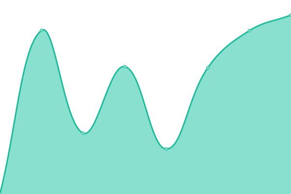 505ms
     
 | 

<a href="https://alliancewebteam.github.io/Uptime/history/castle-hill-resort-and-spa">100.00%</a>
    

|  [Center For Independent Living](https://cilopportunities.org) | 🟩 Up | [center-for-independent-living.yml](https://github.com/alliancewebteam/Uptime/commits/HEAD/history/center-for-independent-living.yml) | 

 734ms
     
 | 

<a href="https://alliancewebteam.github.io/Uptime/history/center-for-independent-living">99.41%</a>
    

|  [Christ Presbyterian Church](https://christchurchcamphill.org) | 🟩 Up | [christ-presbyterian-church.yml](https://github.com/alliancewebteam/Uptime/commits/HEAD/history/christ-presbyterian-church.yml) | 

 2754ms
     
 | 

<a href="https://alliancewebteam.github.io/Uptime/history/christ-presbyterian-church">99.57%</a>
    

|  [Christopher Columbus Scholarship Foundation](https://ccsfyorkpa.org) | 🟩 Up | [christopher-columbus-scholarship-foundation.yml](https://github.com/alliancewebteam/Uptime/commits/HEAD/history/christopher-columbus-scholarship-foundation.yml) | 

 585ms
     
 | 

<a href="https://alliancewebteam.github.io/Uptime/history/christopher-columbus-scholarship-foundation">100.00%</a>
    

|  [Christopher Columbus Scholarship Foundation - Scholarship Application](https://forms.ccsfyorkpa.org) | 🟩 Up | [christopher-columbus-scholarship-foundation-scholarship-application.yml](https://github.com/alliancewebteam/Uptime/commits/HEAD/history/christopher-columbus-scholarship-foundation-scholarship-application.yml) | 

 670ms
     
 | 

<a href="https://alliancewebteam.github.io/Uptime/history/christopher-columbus-scholarship-foundation-scholarship-application">100.00%</a>
    

|  [DB360 Soft Wash](https://db360wash.com) | 🟩 Up | [db-360-soft-wash.yml](https://github.com/alliancewebteam/Uptime/commits/HEAD/history/db-360-soft-wash.yml) | 

 563ms
     
 | 

<a href="https://alliancewebteam.github.io/Uptime/history/db-360-soft-wash">100.00%</a>
    

|  [Down East Granite](https://downeastfab.com) | 🟩 Up | [down-east-granite.yml](https://github.com/alliancewebteam/Uptime/commits/HEAD/history/down-east-granite.yml) | 

 708ms
     
 | 

<a href="https://alliancewebteam.github.io/Uptime/history/down-east-granite">100.00%</a>
    

|  [Dream Home Realty](https://dreamhrpa.com) | 🟩 Up | [dream-home-realty.yml](https://github.com/alliancewebteam/Uptime/commits/HEAD/history/dream-home-realty.yml) | 

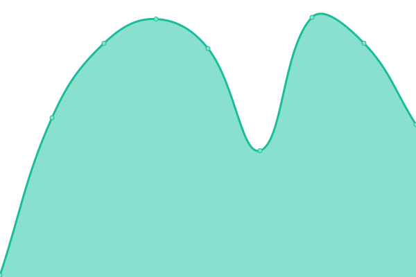 245ms
     
 | 

<a href="https://alliancewebteam.github.io/Uptime/history/dream-home-realty">100.00%</a>
    

|  [Duffy's Bed And Biscuit](https://duffysbedandbiscuit.com) | 🟩 Up | [duffy-s-bed-and-biscuit.yml](https://github.com/alliancewebteam/Uptime/commits/HEAD/history/duffy-s-bed-and-biscuit.yml) | 

 276ms
     
 | 

<a href="https://alliancewebteam.github.io/Uptime/history/duffy-s-bed-and-biscuit">100.00%</a>
    

|  [ELI Consulting](https://educateinnovateinspire.com) | 🟩 Up | [eli-consulting.yml](https://github.com/alliancewebteam/Uptime/commits/HEAD/history/eli-consulting.yml) | 

 892ms
     
 | 

<a href="https://alliancewebteam.github.io/Uptime/history/eli-consulting">100.00%</a>
    

|  [F&M Designs](https://fandmdesigns.com) | 🟩 Up | [f-and-m-designs.yml](https://github.com/alliancewebteam/Uptime/commits/HEAD/history/f-and-m-designs.yml) | 

 115ms
     
 | 

<a href="https://alliancewebteam.github.io/Uptime/history/f-and-m-designs">100.00%</a>
    

|  [Fortney Printing](https://fortneyprinting.com) | 🟩 Up | [fortney-printing.yml](https://github.com/alliancewebteam/Uptime/commits/HEAD/history/fortney-printing.yml) | 

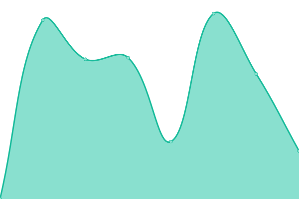 844ms
     
 | 

<a href="https://alliancewebteam.github.io/Uptime/history/fortney-printing">99.43%</a>
    

|  [GES America](https://ges-america.com) | 🟩 Up | [ges-america.yml](https://github.com/alliancewebteam/Uptime/commits/HEAD/history/ges-america.yml) | 

 589ms
     
 | 

<a href="https://alliancewebteam.github.io/Uptime/history/ges-america">100.00%</a>
    

|  [Glossner & Mcelwee Family Dentistry](https://gmdentalcare.net) | 🟩 Up | [glossner-and-mcelwee-family-dentistry.yml](https://github.com/alliancewebteam/Uptime/commits/HEAD/history/glossner-and-mcelwee-family-dentistry.yml) | 

 699ms
     
 | 

<a href="https://alliancewebteam.github.io/Uptime/history/glossner-and-mcelwee-family-dentistry">100.00%</a>
    

|  [Go Life Surfing Inc.](https://golifesurfing.com) | 🟩 Up | [go-life-surfing-inc.yml](https://github.com/alliancewebteam/Uptime/commits/HEAD/history/go-life-surfing-inc.yml) | 

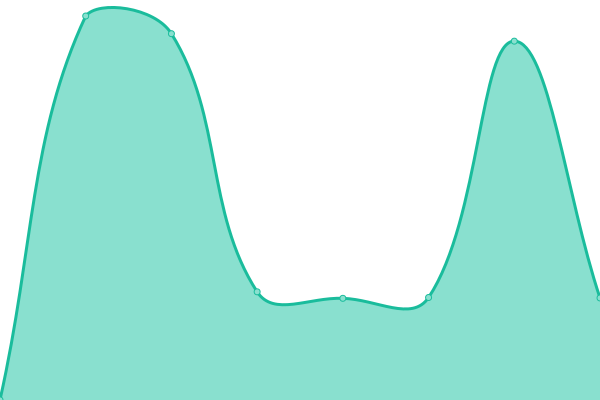 2480ms
     
 | 

<a href="https://alliancewebteam.github.io/Uptime/history/go-life-surfing-inc">99.48%</a>
    

|  [Guth Laboratories](https://guthlabs.com) | 🟩 Up | [guth-laboratories.yml](https://github.com/alliancewebteam/Uptime/commits/HEAD/history/guth-laboratories.yml) | 

 436ms
     
 | 

<a href="https://alliancewebteam.github.io/Uptime/history/guth-laboratories">100.00%</a>
    

|  [Habitat for Humanity of the Greater Harrisburg Area](https://harrisburghabitat.org) | 🟩 Up | [habitat-for-humanity-of-the-greater-harrisburg-area.yml](https://github.com/alliancewebteam/Uptime/commits/HEAD/history/habitat-for-humanity-of-the-greater-harrisburg-area.yml) | 

 4367ms
     
 | 

<a href="https://alliancewebteam.github.io/Uptime/history/habitat-for-humanity-of-the-greater-harrisburg-area">100.00%</a>
    

|  [Habitat for Humanity of the Greater Harrisburg Area - ReStore](https://harrisburgrestore.org) | 🟩 Up | [habitat-for-humanity-of-the-greater-harrisburg-area-re-store.yml](https://github.com/alliancewebteam/Uptime/commits/HEAD/history/habitat-for-humanity-of-the-greater-harrisburg-area-re-store.yml) | 

 1967ms
     
 | 

<a href="https://alliancewebteam.github.io/Uptime/history/habitat-for-humanity-of-the-greater-harrisburg-area-re-store">100.00%</a>
    

|  [Handyworx](https://thehandyworx.com) | 🟩 Up | [handyworx.yml](https://github.com/alliancewebteam/Uptime/commits/HEAD/history/handyworx.yml) | 

 887ms
     
 | 

<a href="https://alliancewebteam.github.io/Uptime/history/handyworx">99.49%</a>
    

|  [Henry's Lock & Key Service](https://henryskeyandlockservice.com/) | 🟥 Down | [henry-s-lock-and-key-service.yml](https://github.com/alliancewebteam/Uptime/commits/HEAD/history/henry-s-lock-and-key-service.yml) | 

 0ms
     
 | 

<a href="https://alliancewebteam.github.io/Uptime/history/henry-s-lock-and-key-service">0.00%</a>
    

|  [Hershey Real Estate Group](https://hersheyreg.com) | 🟩 Up | [hershey-real-estate-group.yml](https://github.com/alliancewebteam/Uptime/commits/HEAD/history/hershey-real-estate-group.yml) | 

 590ms
     
 | 

<a href="https://alliancewebteam.github.io/Uptime/history/hershey-real-estate-group">99.50%</a>
    

|  [Hoem Inc. / Precision Metal Fabricating](https:/precisionmetalpa.com) | 🟩 Up | [hoem-inc-precision-metal-fabricating.yml](https://github.com/alliancewebteam/Uptime/commits/HEAD/history/hoem-inc-precision-metal-fabricating.yml) | 

 835ms
     
 | 

<a href="https://alliancewebteam.github.io/Uptime/history/hoem-inc-precision-metal-fabricating">99.50%</a>
    

|  [Home Builders Association of Metropolitan Harrisburg](https://harrisburgbuilders.com) | 🟩 Up | [home-builders-association-of-metropolitan-harrisburg.yml](https://github.com/alliancewebteam/Uptime/commits/HEAD/history/home-builders-association-of-metropolitan-harrisburg.yml) | 

 682ms
     
 | 

<a href="https://alliancewebteam.github.io/Uptime/history/home-builders-association-of-metropolitan-harrisburg">100.00%</a>
    

|  [HMR Auto Body](https://hmrautobody.com) | 🟩 Up | [hmr-auto-body.yml](https://github.com/alliancewebteam/Uptime/commits/HEAD/history/hmr-auto-body.yml) | 

 642ms
     
 | 

<a href="https://alliancewebteam.github.io/Uptime/history/hmr-auto-body">99.51%</a>
    

|  [Impact Harrisburg](https://impactharrisburg.org) | 🟩 Up | [impact-harrisburg.yml](https://github.com/alliancewebteam/Uptime/commits/HEAD/history/impact-harrisburg.yml) | 

 838ms
     
 | 

<a href="https://alliancewebteam.github.io/Uptime/history/impact-harrisburg">100.00%</a>
    

|  [Indian Creek](https://indiancreekcommunity.org) | 🟩 Up | [indian-creek.yml](https://github.com/alliancewebteam/Uptime/commits/HEAD/history/indian-creek.yml) | 

 5268ms
     
 | 

<a href="https://alliancewebteam.github.io/Uptime/history/indian-creek">100.00%</a>
    

|  [Jaz Design Co](https://jazdesignco.com) | 🟩 Up | [jaz-design-co.yml](https://github.com/alliancewebteam/Uptime/commits/HEAD/history/jaz-design-co.yml) | 

 223ms
     
 | 

<a href="https://alliancewebteam.github.io/Uptime/history/jaz-design-co">100.00%</a>
    

|  [JB Buy Rite](https://jbbuyrite.com) | 🟩 Up | [jb-buy-rite.yml](https://github.com/alliancewebteam/Uptime/commits/HEAD/history/jb-buy-rite.yml) | 

 432ms
     
 | 

<a href="https://alliancewebteam.github.io/Uptime/history/jb-buy-rite">100.00%</a>
    

|  [John Jewett](https://jhowardcahill.com) | 🟩 Up | [john-jewett.yml](https://github.com/alliancewebteam/Uptime/commits/HEAD/history/john-jewett.yml) | 

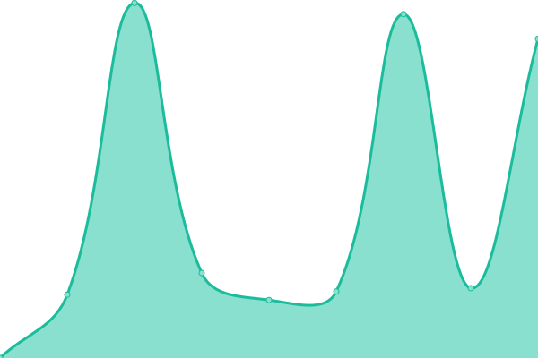 1956ms
     
 | 

<a href="https://alliancewebteam.github.io/Uptime/history/john-jewett">100.00%</a>
    

|  [King's View Acres](https://kingsviewacres.com) | 🟩 Up | [king-s-view-acres.yml](https://github.com/alliancewebteam/Uptime/commits/HEAD/history/king-s-view-acres.yml) | 

 464ms
     
 | 

<a href="https://alliancewebteam.github.io/Uptime/history/king-s-view-acres">99.92%</a>
    

|  [Machining America](https://machiningamerica.com) | 🟩 Up | [machining-america.yml](https://github.com/alliancewebteam/Uptime/commits/HEAD/history/machining-america.yml) | 

 724ms
     
 | 

<a href="https://alliancewebteam.github.io/Uptime/history/machining-america">100.00%</a>
    

|  [Maria Memmi](https://mariamemmi.com) | 🟩 Up | [maria-memmi.yml](https://github.com/alliancewebteam/Uptime/commits/HEAD/history/maria-memmi.yml) | 

 665ms
     
 | 

<a href="https://alliancewebteam.github.io/Uptime/history/maria-memmi">100.00%</a>
    

|  [Matterhorn Bar & Restaurant](https://matterhornbar.com) | 🟩 Up | [matterhorn-bar-and-restaurant.yml](https://github.com/alliancewebteam/Uptime/commits/HEAD/history/matterhorn-bar-and-restaurant.yml) | 

 1616ms
     
 | 

<a href="https://alliancewebteam.github.io/Uptime/history/matterhorn-bar-and-restaurant">92.19%</a>
    

|  [Miller & Son Electro-Plating](https://millerplatingnj.com) | 🟩 Up | [miller-and-son-electro-plating.yml](https://github.com/alliancewebteam/Uptime/commits/HEAD/history/miller-and-son-electro-plating.yml) | 

 230ms
     
 | 

<a href="https://alliancewebteam.github.io/Uptime/history/miller-and-son-electro-plating">100.00%</a>
    

|  [Moyles Law Firm](https://moyleslaw.com) | 🟩 Up | [moyles-law-firm.yml](https://github.com/alliancewebteam/Uptime/commits/HEAD/history/moyles-law-firm.yml) | 

 674ms
     
 | 

<a href="https://alliancewebteam.github.io/Uptime/history/moyles-law-firm">99.61%</a>
    

|  [Mr Sandman Flooring](https://callmrsandman.com) | 🟩 Up | [mr-sandman-flooring.yml](https://github.com/alliancewebteam/Uptime/commits/HEAD/history/mr-sandman-flooring.yml) | 

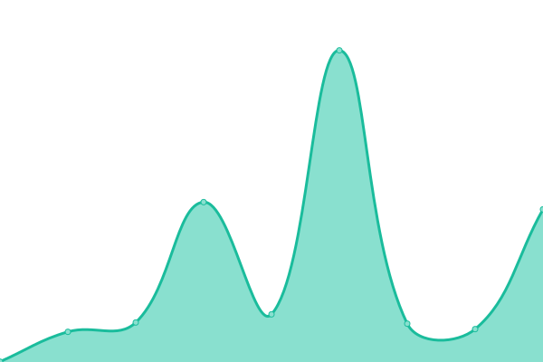 237ms
     
 | 

<a href="https://alliancewebteam.github.io/Uptime/history/mr-sandman-flooring">100.00%</a>
    

|  [Pigott Agency](https://pigottagencyllc.com) | 🟩 Up | [pigott-agency.yml](https://github.com/alliancewebteam/Uptime/commits/HEAD/history/pigott-agency.yml) | 

 855ms
     
 | 

<a href="https://alliancewebteam.github.io/Uptime/history/pigott-agency">99.83%</a>
    

|  [PrimeFyre LLC](https://primefyre.com) | 🟩 Up | [prime-fyre-llc.yml](https://github.com/alliancewebteam/Uptime/commits/HEAD/history/prime-fyre-llc.yml) | 

 376ms
     
 | 

<a href="https://alliancewebteam.github.io/Uptime/history/prime-fyre-llc">100.00%</a>
    

|  [Reach For More](https://reachformore.fit) | 🟩 Up | [reach-for-more.yml](https://github.com/alliancewebteam/Uptime/commits/HEAD/history/reach-for-more.yml) | 

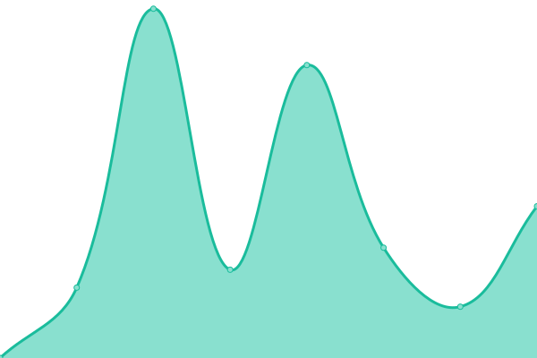 4280ms
     
 | 

<a href="https://alliancewebteam.github.io/Uptime/history/reach-for-more">100.00%</a>
    

|  [Redd's Smokehouse BBQ](https://reddssmokehousebbq.com) | 🟩 Up | [redd-s-smokehouse-bbq.yml](https://github.com/alliancewebteam/Uptime/commits/HEAD/history/redd-s-smokehouse-bbq.yml) | 

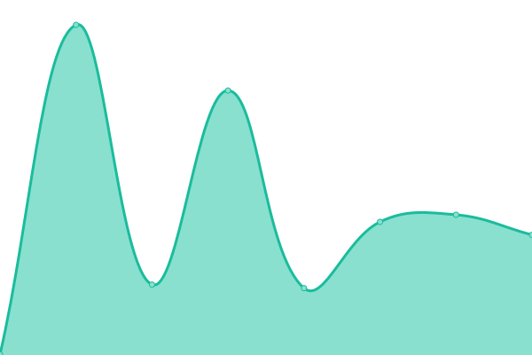 455ms
     
 | 

<a href="https://alliancewebteam.github.io/Uptime/history/redd-s-smokehouse-bbq">100.00%</a>
    

|  [Ruthcliffe Lodge & Restaurant](https://ruthcliffe.com) | 🟩 Up | [ruthcliffe-lodge-and-restaurant.yml](https://github.com/alliancewebteam/Uptime/commits/HEAD/history/ruthcliffe-lodge-and-restaurant.yml) | 

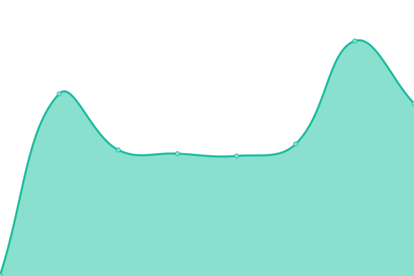 334ms
     
 | 

<a href="https://alliancewebteam.github.io/Uptime/history/ruthcliffe-lodge-and-restaurant">100.00%</a>
    

|  [Saidis, Shultz, & Fisher](https://www.ssfadvocates.com) | 🟩 Up | [saidis-shultz-and-fisher.yml](https://github.com/alliancewebteam/Uptime/commits/HEAD/history/saidis-shultz-and-fisher.yml) | 

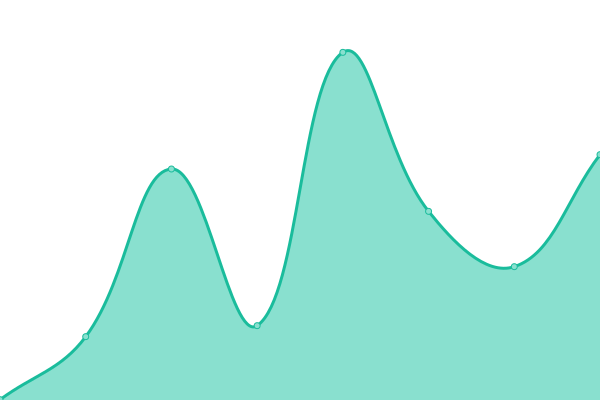 1297ms
     
 | 

<a href="https://alliancewebteam.github.io/Uptime/history/saidis-shultz-and-fisher">99.84%</a>
    

|  [Savannah's](https://sohclub.com) | 🟩 Up | [savannah-s.yml](https://github.com/alliancewebteam/Uptime/commits/HEAD/history/savannah-s.yml) | 

 924ms
     
 | 

<a href="https://alliancewebteam.github.io/Uptime/history/savannah-s">100.00%</a>
    

|  [Shawn's Landscaping](https://shawns-landscaping.com) | 🟩 Up | [shawn-s-landscaping.yml](https://github.com/alliancewebteam/Uptime/commits/HEAD/history/shawn-s-landscaping.yml) | 

 2963ms
     
 | 

<a href="https://alliancewebteam.github.io/Uptime/history/shawn-s-landscaping">100.00%</a>
    

|  [Simply Greek, Hershey](https://simplygreekhershey.com) | 🟩 Up | [simply-greek-hershey.yml](https://github.com/alliancewebteam/Uptime/commits/HEAD/history/simply-greek-hershey.yml) | 

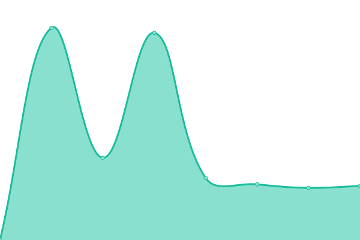 2118ms
     
 | 

<a href="https://alliancewebteam.github.io/Uptime/history/simply-greek-hershey">99.84%</a>
    

|  [Stone and Edwards](https://stoneandedwards.com) | 🟩 Up | [stone-and-edwards.yml](https://github.com/alliancewebteam/Uptime/commits/HEAD/history/stone-and-edwards.yml) | 

 2332ms
     
 | 

<a href="https://alliancewebteam.github.io/Uptime/history/stone-and-edwards">99.85%</a>
    

|  [Strategic Response Firearms Training](https://srft16.com/) | 🟩 Up | [strategic-response-firearms-training.yml](https://github.com/alliancewebteam/Uptime/commits/HEAD/history/strategic-response-firearms-training.yml) | 

 374ms
     
 | 

<a href="https://alliancewebteam.github.io/Uptime/history/strategic-response-firearms-training">100.00%</a>
    

|  [Strube Inc.](https://strubeinc.net) | 🟩 Up | [strube-inc.yml](https://github.com/alliancewebteam/Uptime/commits/HEAD/history/strube-inc.yml) | 

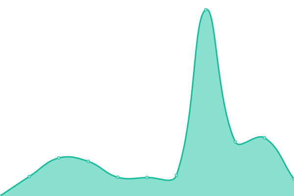 1668ms
     
 | 

<a href="https://alliancewebteam.github.io/Uptime/history/strube-inc">100.00%</a>
    

|  [St. Paul's Evangelical Lutheran Church](https://stpaulsandhill.com) | 🟩 Up | [st-paul-s-evangelical-lutheran-church.yml](https://github.com/alliancewebteam/Uptime/commits/HEAD/history/st-paul-s-evangelical-lutheran-church.yml) | 

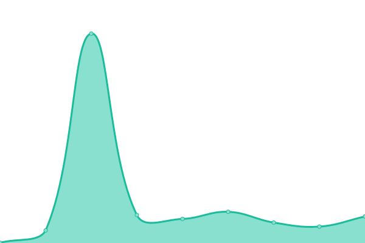 4062ms
     
 | 

<a href="https://alliancewebteam.github.io/Uptime/history/st-paul-s-evangelical-lutheran-church">100.00%</a>
    

|  [Szeles and Associates](https://szelesas.com) | 🟩 Up | [szeles-and-associates.yml](https://github.com/alliancewebteam/Uptime/commits/HEAD/history/szeles-and-associates.yml) | 

 1393ms
     
 | 

<a href="https://alliancewebteam.github.io/Uptime/history/szeles-and-associates">99.85%</a>
    

|  [The Meadows Pet Resort](https://themeadowspetresort.com) | 🟩 Up | [the-meadows-pet-resort.yml](https://github.com/alliancewebteam/Uptime/commits/HEAD/history/the-meadows-pet-resort.yml) | 

 723ms
     
 | 

<a href="https://alliancewebteam.github.io/Uptime/history/the-meadows-pet-resort">100.00%</a>
    

|  [Tritan Pool and Spa](https://tritanpoolandspa.com) | 🟥 Down | [tritan-pool-and-spa.yml](https://github.com/alliancewebteam/Uptime/commits/HEAD/history/tritan-pool-and-spa.yml) | 

 0ms
     
 | 

<a href="https://alliancewebteam.github.io/Uptime/history/tritan-pool-and-spa">0.00%</a>
    

|  [Trix of the Trade Salon](https://trixofthetradesalon.com) | 🟩 Up | [trix-of-the-trade-salon.yml](https://github.com/alliancewebteam/Uptime/commits/HEAD/history/trix-of-the-trade-salon.yml) | 

 803ms
     
 | 

<a href="https://alliancewebteam.github.io/Uptime/history/trix-of-the-trade-salon">100.00%</a>
    

|  [Unlimited Construction Services](https://ucs1.com) | 🟩 Up | [unlimited-construction-services.yml](https://github.com/alliancewebteam/Uptime/commits/HEAD/history/unlimited-construction-services.yml) | 

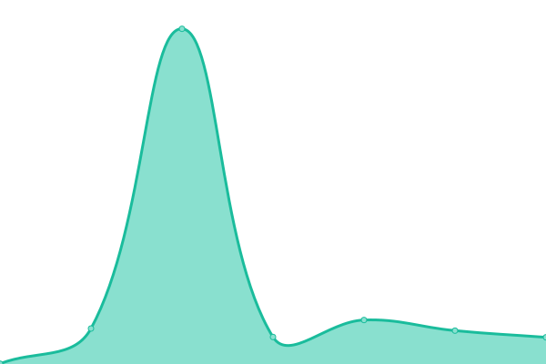 213ms
     
 | 

<a href="https://alliancewebteam.github.io/Uptime/history/unlimited-construction-services">100.00%</a>
    

|  [Upon This Rock Ministries](https://uponthisrock2950.com) | 🟩 Up | [upon-this-rock-ministries.yml](https://github.com/alliancewebteam/Uptime/commits/HEAD/history/upon-this-rock-ministries.yml) | 

 3623ms
     
 | 

<a href="https://alliancewebteam.github.io/Uptime/history/upon-this-rock-ministries">100.00%</a>
    

|  [V3 Fitness Pro](https://v3fitnesspro.com) | 🟩 Up | [v3-fitness-pro.yml](https://github.com/alliancewebteam/Uptime/commits/HEAD/history/v3-fitness-pro.yml) | 

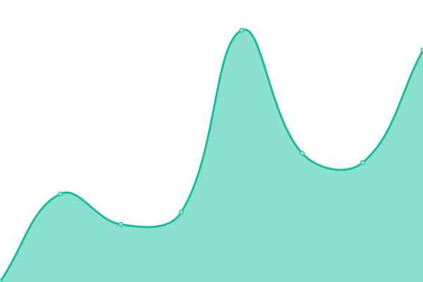 4893ms
     
 | 

<a href="https://alliancewebteam.github.io/Uptime/history/v3-fitness-pro">100.00%</a>
    

|  [Wert Book Binding](https://wertbookbinding.com) | 🟩 Up | [wert-book-binding.yml](https://github.com/alliancewebteam/Uptime/commits/HEAD/history/wert-book-binding.yml) | 

 1688ms
     
 | 

<a href="https://alliancewebteam.github.io/Uptime/history/wert-book-binding">100.00%</a>
    

|  [West Shire Decks](https://westshiredecks.com) | 🟩 Up | [west-shire-decks.yml](https://github.com/alliancewebteam/Uptime/commits/HEAD/history/west-shire-decks.yml) | 

 539ms
     
 | 

<a href="https://alliancewebteam.github.io/Uptime/history/west-shire-decks">100.00%</a>
    

|  [West Shore Elks](https://westshoreelks.org) | 🟩 Up | [west-shore-elks.yml](https://github.com/alliancewebteam/Uptime/commits/HEAD/history/west-shore-elks.yml) | 

 288ms
     
 | 

<a href="https://alliancewebteam.github.io/Uptime/history/west-shore-elks">100.00%</a>
    

|  [Wide Horizons Travel](https://widehorizonstravel.com) | 🟩 Up | [wide-horizons-travel.yml](https://github.com/alliancewebteam/Uptime/commits/HEAD/history/wide-horizons-travel.yml) | 

 141ms
     
 | 

<a href="https://alliancewebteam.github.io/Uptime/history/wide-horizons-travel">100.00%</a>
    

|  [Woodburn Law](https://woodburn-law.com) | 🟩 Up | [woodburn-law.yml](https://github.com/alliancewebteam/Uptime/commits/HEAD/history/woodburn-law.yml) | 

 661ms
     
 | 

<a href="https://alliancewebteam.github.io/Uptime/history/woodburn-law">100.00%</a>
    

|  [Yorklyn Construction](https://yorklynconstruction.com) | 🟩 Up | [yorklyn-construction.yml](https://github.com/alliancewebteam/Uptime/commits/HEAD/history/yorklyn-construction.yml) | 

 5591ms
     
 | 

<a href="https://alliancewebteam.github.io/Uptime/history/yorklyn-construction">99.28%</a>
    

<!--end: status pages-->

[**Visit our status website →**](https://upptime.github.io/upptime)

## 📄 License

- Powered by: [Upptime](https://github.com/upptime/upptime)
- Code: [MIT](./LICENSE) © [Upptime](https://upptime.js.org)
- Data in the `./history` directory: [Open Database License](https://opendatacommons.org/licenses/odbl/1-0/)
